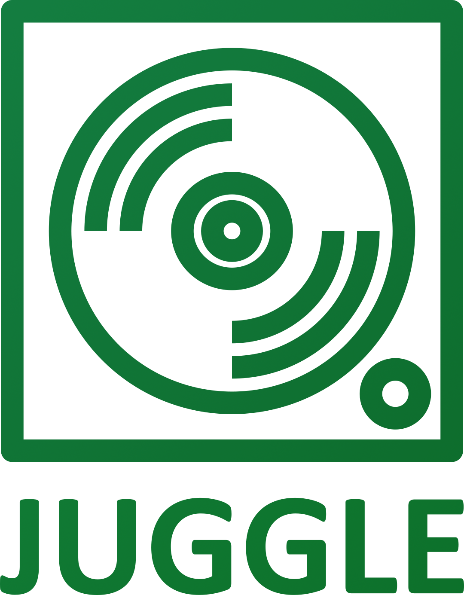

<a name="readme-top"></a>

<!-- PROJECT LOGO -->
<br />
<div align="center">
  <a href="https://github.com/mario-hess/juggle">
    
  </a>
  <br />
  <br />
  <h3 align="center">:musical_note: Juggle :musical_note:</h3>

  <p align="center">
    A simplistic crossplatform audio player for the desktop
    <br />
    <a href="https://github.com/mario-hess/juggle"><strong>Explore the docs »</strong></a>
    <br />
    <br />
    <a href="https://github.com/mario-hess/juggle/issues">Report Bug</a>
    ·
    <a href="https://github.com/mario-hess/juggle/issues">Request Feature</a>
    ·
    <a href="https://github.com/mario-hess/juggle/releases">Releases</a>
  </p>
</div>

<!-- TABLE OF CONTENTS -->
<details>
  <summary>Table of Contents</summary>
  <ol>
    <li>
      <a href="#about-the-project">About The Project</a>
      <ul>
        <li><a href="#built-with">Built With</a></li>
      </ul>
    </li>
    <li>
      <a href="#installation">Installation</a>
      <ul>
        <li>
          <a href="#releases">Releases</a>
        </li>
        <li>
          <a href="#development">Development</a>
        </li>
      </ul>
    </li>
    <li><a href="#roadmap">Roadmap</a></li>
    <li><a href="#contributing">Contributing</a></li>
    <li><a href="#license">License</a></li>
  </ol>
</details>

<!-- ABOUT THE PROJECT -->

## About The Project

[![Product Name Screen Shot][product-screenshot]](https://example.com)

Juggle is a simplistic audio player built with Electron and React. Our goal was to create a crossplatform and easy-to-use audio player for the desktop that supports a variety of audio file formats.

One of the standout features of Juggle is its ease of use. The interface is straightforward and intuitive, allowing users to quickly navigate through their playlists. In addition to its user-friendly interface, Juggle also supports a range of audio file formats, including MP3, WAV, FLAC, and more. This makes it a versatile choice for anyone who wants to listen to music from their local library.

<p align="right">(<a href="#readme-top">back to top</a>)</p>

### Built With

Juggle was built with Electron and React. Electron is a popular open-source framework that enables developers to build cross-platform desktop applications using web technologies such as HTML, CSS, and JavaScript. React, on the other hand, is a JavaScript library used for building user interfaces, allowing developers to create interactive UI components that can be easily reused across different parts of the application. Together, Electron and React provide a powerful combination for building desktop applications that are convenient to build and user-friendly.

[![Electron][electron.js]][electron-url] [![React][react.js]][react-url]

<p align="right">(<a href="#readme-top">back to top</a>)</p>

<!-- GETTING STARTED -->

## Installation

### Releases

- [ ] Linux
- [ ] Windows
- [ ] Mac

<br />

:point_right: The releases are available in the project's [release section](https://github.com/mario-hess/juggle/releases).

<p align="right">(<a href="#readme-top">back to top</a>)</p>

### Development

To install and run this Electron app for development, you will need to follow these steps:

<br />

1. Clone this repository to your local machine using Git:

```
git clone https://github.com/mario-hess/juggle.git
```

2. Navigate to the project directory:

```
cd juggle
```

3. Install the project dependencies using npm:

```
npm install
```

4. Build the Electron app:

```
npm build
```

5. Run the Electron app:

```
npm start
```

<br />

Once you have completed these steps, the Electron app should open and be ready to use on your local machine.

If you encounter any issues during the installation process, please refer to the project's [issue tracker](https://github.com/mario-hess/juggle/issues) or documentation for assistance.

<p align="right">(<a href="#readme-top">back to top</a>)</p>

<!-- ROADMAP -->

## Roadmap

- [ ] Play, pause, stop, and skip track functionality
- [ ] Volume control and mute option
- [ ] Playlist management, including the ability to create and save playlists
- [ ] Repeat and shuffle modes
- [ ] Metadata display for artist, album, and track information
- [ ] Keyboard shortcuts for common actions
- [ ] Drag-and-drop support for adding tracks to the playlist
- [ ] Splash/Loading startup Screen
- [ ] ...

<br/>

:point_right: See the [open issues](https://github.com/mario-hess/juggle/issues) for a full list of proposed features (and known issues).

<p align="right">(<a href="#readme-top">back to top</a>)</p>

<!-- CONTRIBUTING -->

## Contributing

The open source community is all about collaboration and sharing, and that's where you come in! Your contributions are **valued and welcomed**.

If you have a great idea to make the project even better, we'd love to hear it! One way to share your idea is by forking the repository and starting a pull request. You can also raise an issue and tag it as an "enhancement". If you really like the project, please show some love by giving it a :star:!

- Fork the Project
- Create your Feature Branch (`git checkout -b feature/AmazingFeature`)
- Commit your Changes (`git commit -m 'Add some AmazingFeature'`)
- Push to the Branch (`git push origin feature/AmazingFeature`)
- Open a Pull Request

<p align="right">(<a href="#readme-top">back to top</a>)</p>

<!-- LICENSE -->

## License

Distributed under the MIT License. See `LICENSE.txt` for more information.

<p align="right">(<a href="#readme-top">back to top</a>)</p>

<!-- MARKDOWN LINKS & IMAGES -->
<!-- https://www.markdownguide.org/basic-syntax/#reference-style-links -->

[contributors-shield]: https://img.shields.io/github/contributors/mario-hess/juggle.svg?style=for-the-badge
[contributors-url]: https://github.com/mario-hess/juggle/graphs/contributors
[forks-shield]: https://img.shields.io/github/forks/mario-hess/juggle.svg?style=for-the-badge
[forks-url]: https://github.com/othneildrew/Best-README-Template/network/members
[stars-shield]: https://img.shields.io/github/stars/mario-hess/juggle.svg?style=for-the-badge
[stars-url]: https://github.com/mario-hess/juggle/stargazers
[issues-shield]: https://img.shields.io/github/issues/mario-hess/juggle.svg?style=for-the-badge
[issues-url]: https://github.com/mario-hess/juggle/issues
[license-shield]: https://img.shields.io/github/license/mario-hess/juggle.svg?style=for-the-badge
[license-url]: https://github.com/mario-hess/juggle/blob/master/LICENSE.txt
[linkedin-shield]: https://img.shields.io/badge/-LinkedIn-black.svg?style=for-the-badge&logo=linkedin&colorB=555
[linkedin-url]: https://linkedin.com/in/othneildrew
[product-screenshot]: images/screenshot.png
[react.js]: https://img.shields.io/badge/React-20232A?style=for-the-badge&logo=react&logoColor=61DAFB
[react-url]: https://reactjs.org/
[electron.js]: https://img.shields.io/badge/Electron-20232A?style=for-the-badge&logo=Electron&logoColor=61DAFB
[electron-url]: https://www.electronjs.org/
